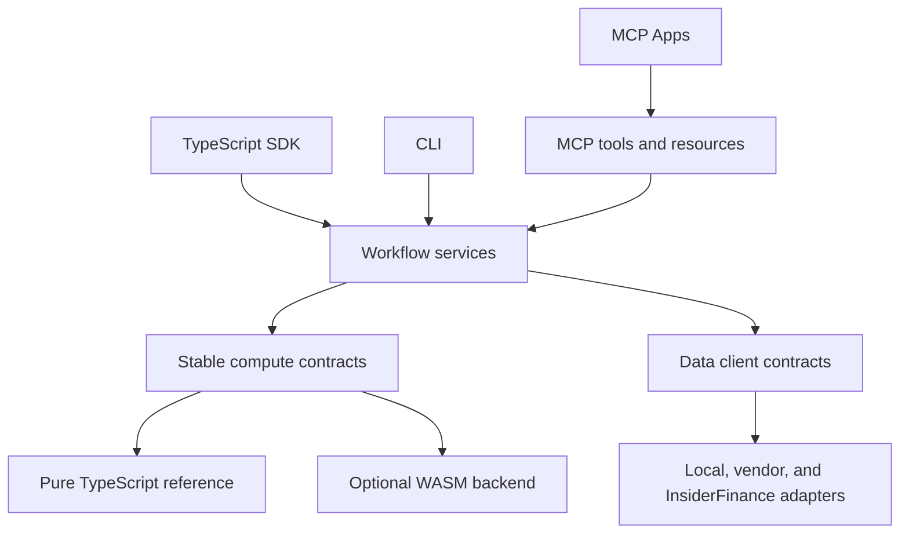

# MCP, acceleration, and data-growth strategy

> **Status:** accepted split sequence; local preview gate queued after Stage 4.5, connected/hosted
> and acceleration gates later
> **Audit snapshot:** `8a29ed21`, 2026-07-21
> **Scope:** the MCP product surface, optional compute acceleration, data-provider architecture,
> and the path from open-source adoption to InsiderFinance subscriptions. This is not a naming or
> launch-documentation review.
> **Execution:** SPLIT. [`implementation-order.md`](./implementation-order.md) owns the global queue.
> After Stage 4.5, Stage 7A pulls forward the protocol-neutral registry, machine-first CLI, generated
> OpenAPI/local HTTP, local jobs/handles, and exemplary read-only MCP before the pre-1.0 preview.
> Data/first-party growth remains Stage 6; connected/hosted/agent operation remains Stage 7B; measured
> acceleration/interop remains Stage 8.
> **Naming authority:** future APIs and commands in this playbook use the canonical vocabulary from
> [`phase-3b-public-naming-normalization.md`](./specs/phase-3b-public-naming-normalization.md).
> Explicit current-state findings may retain a pre-normalization identity only to identify the code
> being audited.
> **Compute-completeness authority:** FC0–FC9 in
> [`finance-portfolio-backtesting-completeness.md`](./specs/finance-portfolio-backtesting-completeness.md)
> freeze the valuation, research, portfolio, and backtesting operations this playbook exposes. The
> preview adapters register only already-green operations and are extended alongside Stage 4.6;
> MCP, data, and acceleration may adapt those contracts but may not redesign or reimplement them.
> **Agent-platform boundary:** [`agent-native-portfolio-and-trading-platform.md`](./agent-native-portfolio-and-trading-platform.md)
> owns the protocol-neutral operation registry, durable portfolio/execution state, trading-agent
> environment, safe proposal/authorization lifecycle, CLI/OpenAPI, and Agent2Agent direction. This
> document continues to own MCP-specific transport/product decisions and deliberately excludes broker
> execution from the MCP surface.

## Executive verdict

The local compute MCP is excellent. It is not yet 10/10 lovable.

The current server gets the hardest foundations right: it wraps the public library rather than a
second implementation, reuses the same runtime and JSON schemas, is read-only by default, returns
structured output, teaches agents how to repair bad quantitative input, bounds work before compute,
and makes stochastic calls reproducible. Its 23 default tools are curated by task rather than being
a mechanical export of hundreds of functions. That is the right philosophy.

The remaining distance is not “add more tools.” It is:

1. close a small set of MCP protocol and agent-DX gaps;
2. move large data through explicit resource handles rather than the model context;
3. add a few end-to-end research workflows over those handles;
4. render the workflows as optional, interactive MCP Apps;
5. offer an authenticated remote MCP whose reason to exist is first-party data, saved research,
   and rich workflows—not hosted calculator calls;
6. accelerate only the workloads that production benchmarks prove are worth accelerating.

The priority order is **Stage 4.5 → local operation/CLI/OpenAPI/MCP preview gate → pre-1.0 preview →
Stage 4.6 plus adapter parity → Stage 4.7/stable release → data contracts and first-party adapter →
connected handles/workflow tools/MCP Apps → remote MCP → measured WASM kernels**. Local machine/agent
access creates an adoption and feedback loop before data arrives; data and rich workflows can then
create subscribers. WASM is a performance
multiplier, not an acquisition strategy.

### Candid scorecard

These scores describe the implementation in this audit, not the eventual documentation or npm
shipping experience.

| Dimension                            | Current | Why                                                                                                                                                         |
| ------------------------------------ | ------: | ----------------------------------------------------------------------------------------------------------------------------------------------------------- |
| Safety, correctness, reproducibility |  9.5/10 | Shared validation, strict inputs, finite JSON, deterministic seeds, read-only filtering, and pre-compute caps are unusually strong.                         |
| Tool selection and API shape         |  8.8/10 | Names and granularity are good; exact packs are excellent. There is not yet a tool-selection eval or a first-class CLI profile experience.                  |
| MCP protocol fidelity                |  8.0/10 | Structured output/resources are strong, but annotations, correct unknown-tool errors, output-schema-safe error payloads, progress, and cancellation remain. |
| Context and workflow efficiency      |  6.5/10 | Raw compute calls are efficient; chains, histories, books, and reports still have to cross the model context as JSON.                                       |
| Rich interaction                     |  3.0/10 | No charts, tables, forms, or live views are exposed through MCP Apps yet.                                                                                   |
| Hosted data/product experience       |  2.0/10 | Deliberately not built: no Streamable HTTP endpoint, OAuth, tenant isolation, entitlements, data handles, or saved artifacts.                               |

**Verdict for the current promise—local, stateless compute: 8.8/10.** It is one focused hardening
pass from outstanding. **Verdict as the complete agent-native quant product: not yet rateable as
10/10**, because the data/workflow half of that product does not exist.

## What was verified

- 23 default tools in ten exact-selectable packs; one payload-heavy backtest tool is opt-in.
- 82 MCP tests pass across server behavior, domain tools, packs, strict validation, output schemas,
  deterministic seeds, direct and wire calls, non-finite JSON handling, and compute caps.
- The default `tools/list` definition is approximately **45,742 bytes** before transport framing.
  The longest tool name is 36 characters. This is meaningful context, but not evidence that the
  tool set should be cut without an agent-selection evaluation.
- The lockfile resolves `@modelcontextprotocol/sdk` 1.29.0. The package range still begins at
  `^1.12.0`; that floor should move when newer protocol fields become required.
- A fresh benchmark run on the audit machine measured:

  | Current TypeScript workload                                               |      Mean |
  | ------------------------------------------------------------------------- | --------: |
  | Scenario map, 1,452 cells over about 360 contracts, including vanna/charm | 364.34 ms |
  | Same scenario map, GEX/DEX only                                           | 175.24 ms |
  | SVI calibration, 3 expiries × 15 strikes                                  |   9.24 ms |
  | CVaR optimization, 250 scenarios × 20 assets                              |   6.71 ms |
  | Constrained minimum variance, 20 assets                                   |   0.39 ms |

The benchmark result matters: the existing acceleration ADR is directionally right, but its prose
says the reference kernels are all sub-millisecond to low-tens-of-milliseconds while its own table
contains a roughly 265 ms scenario map. The current scenario workload is slower still on this
machine. Most of the library does not need WASM; the scenario-map family is already a defensible
pilot.

---

## Part I — the MCP surface

### What already feels right

#### 1. The MCP is a transport over one engine

MCP tools call public TotalFinance APIs. They do not contain alternative pricing, risk, or strategy
logic. This is the most important architectural choice because an SDK call and an agent call cannot
silently become two products with different answers.

The same rule must hold when data, jobs, apps, and acceleration arrive:



No transport or UI layer should own finance logic.

#### 2. Tool granularity is disciplined

The server avoids one MCP tool per exported function. That would be disastrous for context size,
selection quality, and maintenance. Instead, it exposes recognizable user tasks such as option
pricing, strategy analysis, surface fitting, exposure analysis, portfolio optimization, and TA
discovery.

The generic TA calculator plus list/describe tools are the correct pattern for a catalog of roughly
335 indicators. The same principle should govern future areas: expose a small workflow vocabulary
and searchable resources, not every leaf function.

#### 3. Packs are genuinely lovable

`packs` means exact selection. An embedder can grant an agent only options and volatility without
implicitly receiving every default tool, while an explicit spread of `defaultPacks()` plus
`backtestPack()` opts into expansion. This is understandable, composable, and security-friendly.

Keep the current default-pack coverage and the dotted namespace shape. The tool inventory should
remain workflow-oriented, but tool IDs and input schemas must normalize with
[`phase-3b-public-naming-normalization.md`](./specs/phase-3b-public-naming-normalization.md). Dotted
names remain useful for namespacing; legacy abbreviations such as `vol` and `ta` do not remain merely
to avoid pre-1.0 churn.

#### 4. Quantitative failure is treated honestly

The server preserves convergence and warnings, normalizes `NaN`/infinity to JSON `null`, caps rows
and Monte Carlo paths before work begins, and distinguishes malformed input from quantitative
non-convergence. Agents receive machine-readable error codes and teaching prose. This is far beyond
the usual “calculator wrapped in JSON.”

#### 5. The default security posture is correct

Pure compute is local, network-free, and read-only by default. Mutating tools are structurally
removed in read-only mode. Stochastic calls get a deterministic seed only when the selected method
actually samples, and the resolved seed is echoed in assumptions.

These are product features, not implementation details. Preserve them in every future transport.

### What prevents a 10/10 local MCP

#### P0 — protocol correctness

##### Unknown tools must be protocol errors

The current server returns an `isError` tool result with `mcp.unknown_tool`. The stable MCP tool spec
classifies an unknown tool as a JSON-RPC protocol error; `isError` is for a known tool that failed
during input validation or execution. Fixing this improves client interoperability without changing
the useful treatment of quantitative input errors.

Unknown resources and prompts should likewise use the protocol's expected typed errors rather than
a generic thrown `Error` that can be translated into an internal-server failure.

##### Error payloads must not violate success output schemas

Every tool advertises a success-shaped `outputSchema`, but `textError()` also returns
`structuredContent: { error: ... }`. A strict client can validate that error object against the
success schema and reject it.

Choose and enforce one policy across every tool:

- make each output schema an explicit success/error union; or
- omit `structuredContent` on `isError` results, retain actionable JSON in a text block, and put
  protocol metadata in a namespaced `_meta` field where appropriate.

The first policy is richer for agents; the second keeps success schemas simpler. Either is better
than advertising one contract and emitting another. Add a test that validates every golden success
and failure fixture against the exact advertised schema.

##### Publish protocol annotations

The server already knows whether a tool mutates state, but does not expose MCP `annotations`.
Current pure-compute tools should advertise:

```json
{
  "readOnlyHint": true,
  "destructiveHint": false,
  "openWorldHint": false
}
```

Hosted data queries remain read-only but become `openWorldHint: true`. Handle creation or saved
workspace operations need accurate additive/idempotent/destructive annotations. This allows hosts
to present the right trust UX instead of inferring behavior from prose.

##### A deadline must be able to stop work

`deadlineMs` is currently honest but post-hoc: synchronous compute finishes before elapsed time is
checked. Keep pre-compute cost caps, then add cooperative `AbortSignal` and progress hooks to heavy
workflow contracts. Run expensive local/hosted work in a reusable worker pool or job worker so a
cancel request can actually stop it and free resources.

The stable MCP protocol supports request cancellation and monotonic progress notifications. Its
task primitive is useful for durable, fetch-later jobs but is still marked experimental. TotalFinance
should define a stable internal `Job` abstraction first, then adapt it to MCP tasks for clients that
negotiate support. Do not let an experimental wire primitive become the core library's job model.

#### P0 — agent experience

##### Replace impossible prompts with executable workflows

`screen-options-chain` asks the agent to screen a chain that the server cannot fetch and the prompt
does not provide. That invites hallucinated data. Remove it from the current server until a chain
handle exists, or make a supplied handle mandatory. When the data layer lands, restore it as a real
workflow over an immutable dataset.

`analyze-option-trade` should be checked end-to-end against exactly the fields its selected tools
return. Prefer one grounded workflow call when several raw calls plus agent arithmetic can produce
inconsistent conventions.

Prompts should be a small set of golden user journeys, not marketing copy and not a second tool
catalog.

##### Add a real CLI configuration surface

The embedding API has excellent pack selection; the `totalfinance-mcp` binary exposes none of it. Add:

```text
totalfinance-mcp --help
totalfinance-mcp --version
totalfinance-mcp --packs options,volatility,strategy
totalfinance-mcp --profile default|options|research|full
totalfinance-mcp doctor
```

Budget and seed settings should also have documented flags or environment variables. Explicit help
and doctor output may go to the terminal, but once stdio protocol mode starts, stdout must remain
JSON-RPC-only.

Keep all 23 tools in the default profile for now. Add profiles so users can choose, then use the
selection eval below to decide whether a smaller default actually performs better. A 45.7 KB tool
definition is a cost to manage, not a reason to guess.

##### Measure agent lovability

Unit tests prove server mechanics, not whether agents use the server well. Build a versioned eval
set of at least 100 natural-language tasks across supported clients and models. Measure:

- correct tool or workflow selection;
- valid arguments on the first attempt;
- recovery after one teaching error;
- numerical agreement with the direct SDK;
- refusal to invent unavailable live data;
- context bytes and tool calls per completed task;
- latency, cancellation, and result comprehension;
- behavior under default, options-only, and full profiles.

A 10/10 gate should require at least 95% correct tool selection, 90% first-call argument validity,
and 99% completion after one repair opportunity on the maintained golden set. Thresholds can evolve,
but the eval itself is mandatory.

##### Add server-level instructions

Use MCP initialization instructions to teach the few rules that apply globally: decimal rate and
volatility units, years-to-expiry, assumptions/diagnostics, deterministic seeds, pure compute versus
live data, and when to use resources instead of pasting arrays. Do not repeat this paragraph in
every tool.

#### P1 — context-efficient state and artifacts

The next MCP should be stateful in product capability but stateless in protocol assumptions. Do not
store the active portfolio, dataset, or experiment implicitly against a stdio or HTTP connection. Mint
explicit handles that survive reconnects, can be authorized independently, and can be placed in a
reproducible link.

The roadmap records this as durable agent portfolio workflows implemented through **explicit, scoped
workspace handles**.

```ts
interface ResourceHandle {
  uri: string; // totalfinance://datasets/ds_... or totalfinance://reports/rpt_...
  kind: 'dataset' | 'portfolio' | 'job' | 'report';
  schema: string;
  version: string;
  createdAt: string;
  expiresAt?: string;
  owner?: string;
  rowCount?: number;
  byteLength?: number;
  provenance: Provenance;
}
```

Handles should be immutable where practical, opaque, tenant-scoped, unguessable, TTL-aware, and
explicitly authorized on every read. Content-addressed local handles can make repeated imports
idempotent. Hosted “latest” queries must resolve to a versioned `asOf` snapshot before analysis.

Recommended resource templates:

| Resource                        | Purpose                                                                                                |
| ------------------------------- | ------------------------------------------------------------------------------------------------------ |
| `totalfinance://capabilities`   | Available compute packs, data capabilities, limits, and negotiated features.                           |
| `totalfinance://datasets/{id}`  | Dataset metadata, schema, provenance, quality, and compact preview—not an automatic dump of every row. |
| `totalfinance://books/{id}`     | Versioned positions and market snapshot references.                                                    |
| `totalfinance://jobs/{id}`      | Durable status, progress, diagnostics, and result links.                                               |
| `totalfinance://reports/{id}`   | Compact report plus links to larger tables, images, and the web experience.                            |
| `totalfinance://schemas/{name}` | The existing schema catalog under a parameterized, paginated resource surface.                         |

Tools should return compact summaries and `resource_link` content for large artifacts. Resource
lists and templates must paginate; changing hosted resources can support subscriptions and
`listChanged` notifications. Thousands of chain rows should never be routed through an LLM merely
to move them from a data provider into a compute function.

#### P1 — a few workflow tools, not a second explosion

Raw compute tools remain valuable building blocks. Add high-level tools only where they remove
context transfer, repeated convention choices, or fragile agent arithmetic:

| Proposed hosted/workflow tool | Job                                                                                                 |
| ----------------------------- | --------------------------------------------------------------------------------------------------- |
| `totalfinance.data.catalog`   | Discover available datasets, coverage, latency, and entitlement without guessing.                   |
| `totalfinance.data.snapshot`  | Resolve a quote/chain/flow request to a versioned dataset handle.                                   |
| `totalfinance.data.history`   | Resolve paged historical data to a handle or durable job.                                           |
| `totalfinance.chain.analyze`  | From one chain handle: normalize, solve IV/Greeks, calculate structure, and return a report handle. |
| `totalfinance.book.analyze`   | Value a versioned book, aggregate Greeks/risk, and explain assumptions.                             |
| `totalfinance.backtest.run`   | Launch a bounded, cancellable backtest job over a dataset handle.                                   |

These belong in hosted or explicitly selected workflow packs, not automatically in the current
local-compute profile. Data retrieval and compute remain separate internally even when a workflow
composes them.

#### P1 — make the output visual with MCP Apps

MCP Apps are now a stable official extension and are a near-perfect fit for quant workflows. Tools
can continue to return portable text and structured data, while supporting hosts render a sandboxed
interactive view as progressive enhancement.

Build a separate optional MCP Apps package or asset bundle so the core compute server remains lean.
Attach views to existing workflow tools rather than inventing UI-only duplicates:

- strategy payoff with spot-price, volatility, and time-to-expiry controls;
- filterable option-chain and flow tables;
- GEX profile, walls, zero-gamma, and scenario slider;
- rotatable or sliced volatility surface;
- portfolio risk and P&L-explain dashboard;
- backtest equity, drawdown, trades, and research-hygiene tear sheet.

Every view must degrade to the same structured/text result when the client does not support MCP
Apps. The app calls the same server tools, receives the same report handles, and owns no finance
logic. This is both a lovability feature and a product funnel: users can experience the analysis in
their conversation, then open or save the exact versioned report in InsiderFinance.

#### P2 — remote MCP is a product, not a transport checkbox

Do not host the current calculator wrapper by itself. A remote server earns its operational burden
when it provides:

- first-party and connected data;
- immutable datasets and saved workspaces;
- long-running, cancellable jobs;
- shareable, reproducible reports;
- richer MCP App views;
- account entitlements, quotas, and history.

Use Streamable HTTP and the MCP OAuth profile. The authorization layer must support protected
resource metadata, PKCE, audience-bound access tokens, least-privilege/step-up scopes, and strict
tenant checks. Never pass an MCP access token through to an upstream market-data provider; upstream
credentials are a separate security domain.

Suggested authorization capabilities are product abilities rather than plan names, for example:

```text
data:delayed
data:realtime
options-flow:read
options-history:read
research:write
alerts:write
```

Plans map to capabilities. A plan rename should not break every client integration.

---

## Part II — acceleration

### Verdict: build a WASM pilot, not a WASM rewrite

Pure TypeScript remains the canonical implementation and default dependency. It is already fast
enough for scalar pricing, ordinary calibration, small portfolio optimization, and most interactive
research. Rewriting all 14 packages would add a second correctness surface, asynchronous loading,
debugging friction, larger artifacts, and platform-specific release work while making many calls no
faster.

There is, however, enough evidence to prototype a fused scenario-map kernel now. A 175–364 ms call
is visible in an interactive product and can block a Node event loop. Large chain pricing, IV
inversion, Monte Carlo, and production-sized optimization are the next candidates—but only after
workload traces and size-scaled benchmarks identify their break-even points.

### Acceleration laws

1. **No public API fork.** Existing inputs, outputs, units, assumptions, diagnostics, and error
   codes remain the contract.
2. **TypeScript is the executable reference.** Every accelerated result is compared with it.
3. **Acceleration is optional.** No WASM binary, native install script, or worker runtime enters a
   leaf compute package or the default browser bundle.
4. **Batch boundaries only.** Do not cross JS/WASM for one scalar price. Transfer typed columns,
   perform substantial work, and fill caller-owned output buffers.
5. **Float64 by default.** Financial kernels do not silently lose precision to gain a benchmark.
6. **Determinism is explicit.** Same seed, backend version, and reproducibility tier produce the
   documented result; worker count should not change Monte Carlo streams.
7. **Backend identity is disclosed.** Diagnostics report `typescript`, `wasm-simd`, `native`, or an
   experimental backend and its version.
8. **Fallback is observable.** A failed accelerator load may fall back only under an explicit
   `auto` policy, with a diagnostic—not silently after the caller requested `wasm`.
9. **Cold cost counts.** Download, compile, instantiate, allocation, copy, and worker startup are
   part of the benchmark.
10. **No fast-math surprise.** Any relaxed numerical mode is separately named and opt-in.

### Target API

**September 22 packaging/DX amendment:** this section is future work, not an API available in
0.1.0. It supersedes the earlier required `createTotalFinance({ compute })` design. The main npm
package is `@insiderfinance/totalfinance`; acceleration is an optional companion, provisionally
`@insiderfinance/totalfinance-wasm`, not a second mandatory library or a port of every domain.

The current struct-of-arrays `Float64Array` APIs and `*Into` variants are the correct ABI. Add a
small backend SPI with explicit once-per-runtime activation; do not add `backend` to hundreds of
function calls. Installing or importing the companion must not activate global state by itself.

```ts
// Proposed future API — not shipped in 0.1.0.
import { enableWasm } from '@insiderfinance/totalfinance-wasm';
import { blackScholesPriceMany } from '@insiderfinance/totalfinance/options';

await enableWasm({ mode: 'auto' });
const result = blackScholesPriceMany(columns); // same import, arguments, result and synchronous call
```

Before activation, ordinary imports use TypeScript. After activation, eligible batch calls can use
the registered backend; scalar calls and unsupported/small workloads remain TypeScript according to
the explicit policy. Require idempotent concurrent initialization, a version-compatible shared
registry per installed main-library instance, inspectable backend/fallback status, and safe worker
startup (each worker is its own runtime). Strict WASM mode must refuse initialization/capability
failures instead of silently falling back. An isolated advanced context may be added for callers
needing independent backend policies; it is not the primary beginner path.

Do not add a duplicate `/wasm/options` function surface at first. The companion's explicit startup
keeps the usual import paths valid and prevents main-package users from downloading WASM accidentally.
Browser support is required: bundler-safe asset resolution, configurable asset location, correct
WASM MIME/CSP guidance, and no Node built-ins in the browser entry point. WASM does not automatically
move work off the UI thread; heavy browser work belongs in a worker. Threads/shared memory are an
optional capability with their own cross-origin-isolation requirements, not a prerequisite for
ordinary single-threaded WASM.

The target backend contract should be narrow and capability-based:

```ts
interface ComputeBackend {
  readonly id: string;
  readonly version: string;
  readonly capabilities: ReadonlySet<
    | 'black-scholes-price-many'
    | 'black-scholes-greeks-many'
    | 'black-scholes-implied-volatility-many'
    | 'scenario-map'
    | 'monte-carlo'
  >;
  blackScholesPriceManyInto?(input: OptionBatchColumns, output: Float64Array): void;
  scenarioMapInto?(
    input: ExposureColumns,
    grid: ScenarioGridColumns,
    output: ScenarioColumns,
  ): void;
}
```

The activated dispatch chooses the reference kernel when a backend lacks a capability or when a batch is
below the measured crossover threshold. Advanced callers can require a backend and reject fallback.
Worker/job orchestration is a separate asynchronous layer that chunks these synchronous kernels,
owns `AbortSignal`, and publishes progress; the public API never returns a `void | Promise<void>`
union based on the chosen backend.

### Kernel order

#### 1. Fused exposure scenario maps

This is the first pilot. Convert the immutable exposure profile to struct-of-arrays once, then fuse
the spot-price × volatility × time-to-expiry loops with Black-Scholes Greeks. Avoid rebuilding
objects or crossing the JS boundary per contract or cell. Expose progress and cancellation at
cell/chunk boundaries.

Success gate: at least 3× warm speedup on the current 1,452-cell workload or a warm p95 under 100 ms
on declared reference hardware, while matching the TypeScript output within documented tolerances.
The end-to-end call—including packing—must improve by at least 25%.

#### 2. Batch Black-Scholes price, Greeks, and implied volatility

Port `blackScholesPriceManyInto` first, then a fused price+Greeks variant and batch implied
volatility. Use WASM SIMD over contiguous Float64 columns. Keep small batches in JavaScript when
boundary cost wins. Add benchmarks at 1, 16, 128, 1k, 10k, and 100k rows so the crossover is measured
rather than assumed.

#### 3. Monte Carlo generation and payoff reduction

Move path generation and reduction together; returning every path defeats the memory benefit. Use a
counter-based or path-indexed random stream so results do not change when work is split across a
different number of workers. Return requested aggregates and an optional sampled-path artifact.

#### 4. Large calibration and optimization

Current SVI and small CVaR workloads are already interactive. Revisit global Heston calibration,
large CVaR scenario sets, covariance/eigendecomposition, and surface construction only with realistic
institutional dimensions. Do not port a 0.39 ms optimizer because it sounds mathematically serious.

#### 5. TA only after profiling

Streaming TA is usually memory-bandwidth- and JavaScript-loop-friendly already. Port only indicators
that dominate real dashboards at scale, and retain exact warmup/null alignment.

### Workers, WASM, native, and WebGPU have different jobs

- **Workers** prevent heavy compute from blocking the UI or hosted event loop and enable real
  cancellation. Node workers can transfer `ArrayBuffer`s or share `SharedArrayBuffer`s. A reusable
  pool is essential; a new worker per call is not lovable.
- **WASM SIMD** is the first portable acceleration target across browser and Node. Fixed-width SIMD
  is standardized across current major engines. Keep module initialization explicit and cache one
  compiled module per runtime.
- **Native addons** may beat WASM for large server workloads, but their prebuild/platform matrix and
  install behavior make them a poor first adoption dependency. If built, ship them in a separate
  server-only package and select them only when explicitly installed.
- **WebGPU** remains an experiment for enormous, embarrassingly parallel simulations. WGSL's concrete
  floating-point types are f32/f16 rather than f64, and GPU availability/driver behavior complicate
  reproducibility. Never make it the automatic financial-accuracy backend without a separately
  validated precision contract.

This refines the existing acceleration ADR: **product implementation order should be WASM → optional
native**, even if an `auto` runtime may prefer an explicitly installed native backend over WASM.

### Arrow is as important as the kernel

Apache Arrow's columnar format is vectorization-friendly and supports zero-copy shared-memory use.
An Arrow adapter should map compatible buffers into TotalFinance columns without row-object expansion.
That benefits TypeScript, workers, WASM, Python/R interop, and hosted data handles even before a
single kernel is ported.

WASM alone does not make TotalFinance lovable to Python users. A future Python bridge needs native
NumPy/Arrow-shaped inputs, Pythonic errors and docs, wheels or a dependable runtime, and low crossing
frequency. Build that bridge when demand is demonstrated; do not call a raw WASM export a Python
SDK.

### Performance release gate

The published benchmark suite should include:

- Node LTS and the current major browsers on x64 and arm64;
- warm and cold latency, p50/p95/p99, throughput, memory, and artifact size;
- small-to-large size curves and measured backend crossover thresholds;
- main-thread responsiveness and cancellation latency;
- TypeScript versus WASM SIMD, worker+TypeScript, and worker+WASM;
- parity/property tests, convergence behavior, and deterministic stochastic fixtures;
- production-shaped chains and books, not only micro-kernels;
- stable reference hardware metadata and historical regression charts in CI.

Do not gate every PR on noisy wall-clock comparisons. Run correctness on every PR, stable smoke
budgets on controlled CI, and fuller trend benchmarks on scheduled/reference runners.

---

## Part III — data connections and subscriber growth

### Verdict: the existing data thesis is right, but the provider API needs one revision

[`data-layer.md`](./data-layer.md) has the correct constitutional choices:

- compute packages never fetch;
- data is optional and normalized to core types;
- credentials live in Node/hosted adapters, never browser-safe compute;
- provenance travels with results;
- adapters are separate packages;
- InsiderFinance is a first-class provider without making other providers second-class;
- MCP consumes dataset handles rather than giant row payloads.

Do not freeze its proposed interface as currently written. Two parts would be persistently awkward:

1. `Promise<T[]> | AsyncIterable<T>` forces every caller to branch at runtime after making an
   ordinary request. Snapshot/paged queries and subscriptions are different operations and should
   have different methods.
2. Requiring `bars` makes an options-only, rates-only, or filings-only adapter implement a fake
   capability. Provider capabilities should be explicit and composable.

The contract also needs pagination, cancellation, point-in-time semantics, entitlement/freshness
metadata, and an extension route for proprietary datasets before it becomes public.

### Recommended two-level API

Use one discriminated provider SPI for adapter authors and a discoverable method facade for ordinary
users.

```ts
interface DataProvider {
  readonly id: string;
  capabilities(): Promise<DataCapabilities>;

  query<R extends DataRequest>(
    request: R,
    options?: { signal?: AbortSignal; timeoutMs?: number },
  ): Promise<DataPage<DataFor<R>>>;

  subscribe?<R extends LiveDataRequest>(
    request: R,
    options?: { signal?: AbortSignal },
  ): AsyncIterable<DataEvent<DataFor<R>>>;
}
```

The front door exposes named, autocomplete-friendly methods and hides the provider dispatch:

```ts
const totalfinanceClient = createTotalFinance({ data: provider });

const chain = await totalfinanceClient.data.optionChain({
  underlying: 'SPY',
  expiry: '2026-07-17',
  asOf: '2026-07-15T19:30:00Z',
});

for await (const event of totalfinanceClient.data.live.optionTrades({
  underlying: ['SPY', 'QQQ'],
})) {
  // explicitly a stream; never a Promise-or-iterable union
}
```

The facade always has the normal methods. A provider without the requested capability returns a
typed `data.unsupported_capability` error that names providers/capabilities that can satisfy it.
Adapter authors implement only the discriminated request kinds they advertise.

### The data envelope

Large or historical queries must page, and every response must explain what the data is:

```ts
interface DataPage<T> {
  data: T[];
  nextCursor?: string;
  metadata: {
    provider: string;
    dataset: string;
    schemaVersion: string;
    datasetVersion?: string;
    asOf: string;
    receivedAt: string;
    delayedByMs?: number;
    adjustment?: 'raw' | 'split' | 'split-and-dividend';
    quality: DataQualitySummary;
    entitlement: DataEntitlement;
    requestId: string;
  };
}
```

Required request concepts vary by dataset, but the system must have canonical semantics for:

- `asOf` and point-in-time queries;
- event time versus provider receipt time;
- raw versus adjusted prices and corporate-action versions;
- exchange/session/calendar and timezone;
- symbol identity and symbology mapping, including OCC/OSI options;
- ascending/descending sort, page size, and opaque cursor;
- delayed versus real-time status;
- data quality, gaps, stale/crossed markets, and corrections;
- entitlement and redistribution class;
- request cancellation, retry, rate limit, and cache behavior.

Backtests must be able to request only information known at each historical timestamp. “Latest
normalized data” is not an acceptable substitute for point-in-time data.

### Universal data versus proprietary datasets

Keep canonical types for broadly portable primitives: bars, quotes, trades, option chains, option
trades, dividends, corporate actions, rates, and instrument definitions.

Do not force every proprietary feed into `MarketDataProvider`. Add a namespaced dataset catalog for
provider-specific data and derived products. InsiderFinance's enriched flow fields or a vendor's
special auction signal can remain available without polluting the universal contract:

```text
core/option-trades
core/option-chain
com.insiderfinance/options-flow
com.insiderfinance/chain-history
```

GEX, strategy metrics, and flow classification should be computed by TotalFinance from canonical data
where possible. If a provider also supplies a precomputed value, mark it as a provider-derived
dataset with its methodology/version; never make it look interchangeable with a TotalFinance result
without evidence.

### Adapter tiers and order

#### Tier A — contract proof and local adoption

- memory/fixture adapter;
- CSV and JSON adapters;
- Arrow adapter, followed by Parquet/DuckDB where appropriate;
- an adapter conformance kit that every official/community adapter must pass.

The conformance kit should test capability truthfulness, paging, aborts, timestamps, sorting,
normalization, provenance, quality flags, and typed errors—not merely whether a request returns rows.

#### Tier B — first-party product bridge

Build the InsiderFinance adapter alongside the contract proof, not after a long parade of generic
vendors. It is the best test of option chains, option trades/flow, GEX inputs, entitlements, history,
and streaming—and it creates immediate product value.

The current app already has important raw ingredients:

- option-flow and free-flow API routes;
- GEX routes and cached chain data;
- an option-chain endpoint backed by server-side provider calls;
- Firebase/Hasura viewer claims, including an OPRA-agreement expiration;
- Stripe subscription state.

Those are foundations, not yet a public data API. Some current routes still contain explicit TODOs
for subscription enforcement and rate limiting, and their payloads are app-specific. Do not expose
them directly through a public adapter or remote MCP. Put a normalized, versioned data service in
front of them with uniform authorization, quotas, provenance, and errors.

#### Tier C — public/reference data

- SEC EDGAR is a strong no-key adapter for filings/XBRL, subject to its fair-access policy and
  server-side caching. The SEC currently asks automated clients to stay at or below ten requests per
  second in aggregate.
- FRED is useful for curves and macro series, but current API guidance requires API keys and says
  application users should use their own key. Treat it as BYOK unless commercial terms say
  otherwise.

These providers make onboarding useful without pretending free public sources can replace licensed
real-time options data.

#### Tier D — user-connected market-data vendors

Alpaca, Databento, Polygon, IBKR, and similar adapters expand adoption and establish TotalFinance as a
neutral compute layer. Keep credentials server-side/BYOK and report provider entitlements exactly.
Official adapters can live separately and share the conformance kit; community adapters should be
clearly labeled rather than silently treated as first-party-supported.

### The subscription strategy

The cleanest business model is:

> **Compute is open and complete. Data freshness, proprietary history, saved state, live workflows,
> alerts, collaboration, and operational convenience are the paid product.**

Do not cripple formulas or poison local results with promotions. A user who brings their own data
should be able to use the open-source library fully. InsiderFinance should win because its connection
is the most complete and effortless path for options traders, not because generic adapters are
artificially broken.

#### The conversion journey

1. A developer installs TotalFinance or the local MCP and gets useful deterministic compute with no
   account.
2. They ask an agent a live question such as “analyze today's SPY 0DTE positioning.”
3. The local server explains that live data is not connected and returns one clear connection URL;
   it does not fabricate data or advertise during unrelated compute.
4. OAuth sign-in creates or connects a free InsiderFinance account. The original request can retry
   without the user re-entering arguments.
5. A permitted delayed/sample dataset resolves to a handle; a workflow returns an interactive GEX
   view plus provenance and freshness.
6. A request for a premium capability returns a typed entitlement response naming exactly what is
   required and why. Upgrade completes through the web product, then the same request retries.
7. The user saves the versioned scenario/report, opens the full dashboard, creates an alert, shares
   research, or returns to its history. Those retention features—not an arbitrary API wall—justify
   the subscription.

#### Entitlement errors should be helpful, not sales copy

```json
{
  "error": {
    "code": "data.entitlement_required",
    "capability": "options-flow:realtime",
    "message": "This account can access delayed flow; this request requires real-time flow.",
    "connectUrl": "https://insiderfinance.com/connect/mcp",
    "upgradeUrl": "https://insiderfinance.com/upgrade?capability=options-flow%3Arealtime",
    "retryable": false
  }
}
```

Never silently substitute delayed, sampled, truncated, or indicative data for real-time OPRA data.
If the user explicitly allows a fallback, echo it in the result metadata.

#### Capability tiers, not hard-coded plans

Exact prices and plan names are commercial decisions. The software boundary should support:

| Experience             | Candidate capabilities                                                                                 |
| ---------------------- | ------------------------------------------------------------------------------------------------------ |
| Anonymous/local        | All pure compute; local files and user adapters.                                                       |
| Free connected account | Licensed delayed/sample data where permitted, modest quotas, temporary reports.                        |
| Paid individual        | Real-time flow/chains/GEX, useful history, higher quotas, saved research, alerts, exports.             |
| Professional/team      | Professional data entitlements, longer history, collaboration, audit, service guarantees, larger jobs. |

Licensing decides what can be offered in each tier. Product code must not assume “15-minute delayed”
or “derived” automatically means freely redistributable.

### Licensing is a first-class architecture constraint

OPRA distinguishes vendors, professional subscribers, and nonprofessional subscribers, and requires
agreements/fees for redistribution of current options data. Every external recipient of current data
must be entitled correctly. The existing OPRA agreement claim is therefore valuable and should become
part of one centralized entitlement service used by the app, SDK gateway, and MCP.

Before exposing any raw or derived options dataset, document with counsel and the upstream vendor:

- display, non-display, internal, and external-distribution rights;
- professional/nonprofessional classification and agreement capture;
- device/user/query reporting duties;
- delayed and historical redistribution rules;
- whether flow classifications, GEX, aggregates, screenshots, AI summaries, and saved reports are
  treated as derived data and under what conditions;
- retention, caching, export, and share-link limits;
- what an LLM or MCP client counts as for display/non-display use.

This is not a footer disclaimer. It determines handle authorization, cache TTLs, export behavior,
report sharing, and even what an MCP App may render.

### Hosted data security and operations

- Keep vendor credentials in server-only adapters or a secrets service. The browser and model never
  receive them.
- Federate existing user identity into a standards-compliant OAuth authorization service for MCP;
  issue short-lived, audience-bound, scoped tokens.
- Authorize every handle read against tenant, capability, OPRA status, and dataset policy.
- Separate MCP tokens from upstream provider tokens; never use token passthrough.
- Apply per-user and per-tenant cost budgets before fetching/compute, plus concurrency and rate
  limits.
- Record an activity trail: caller, tool, normalized request hash, dataset versions, assumptions,
  backend, seed, result/report IDs, and cost—not raw secrets.
- Encrypt stored datasets/reports, expire temporary artifacts, and make deletion/account revocation
  effective across caches.
- Treat telemetry in the open-source local library as opt-in. Hosted operational telemetry should
  be disclosed and avoid raw portfolio/trade payloads unless essential and authorized.

---

## Recommended implementation sequence

### Preview Gate — make local machine and MCP access exemplary

- [x] (Stage 7A, c7bdb260d) Adapt one protocol-neutral operation registry from the agent-platform AT2 contract; MCP does
      not own a parallel request, result, budget, or effect schema.
- [x] (Stage 7A, c7bdb260d) Generate machine-first CLI JSON and OpenAPI/local HTTP from those operation contracts and prove
      SDK/operation/CLI/HTTP/MCP semantic parity.
- [x] (Stage 7A, c7bdb260d) Return protocol errors for unknown tools/resources/prompts.
- [x] (Stage 7A, c7bdb260d; policy B — an error result carries the OperationError JSON in its text content and no `structuredContent`) Make all error `structuredContent` conform to advertised output schemas.
- [x] (Stage 7A, c7bdb260d) Publish accurate tool annotations and server instructions.
- [x] (Stage 7A, c7bdb260d) Remove or disable the impossible chain-screen prompt until data handles exist.
- [x] (Stage 7A, c7bdb260d) Add CLI help, doctor, profiles, and pack/budget/seed configuration.
- [x] (Stage 7A, c7bdb260d) Add local artifact/book/scenario/result/job handles with explicit lifetime and no hidden MCP
      connection state.
- [x] (Stage 7A, c7bdb260d: a job-class operation runs in a worker that `cancelJob` terminates from any process; `JobRecord.progress` is the contract; loop-level checks inside compute are a Stage 4.6/7B item) Add cooperative cancellation/progress contracts for heavy work.
- [ ] Build the cross-client natural-language MCP eval.
- [x] (Stage 7A, c7bdb260d: counts are computed claims, `technical_analysis.describe` named, the per-call stochastic predicate described) Correct the small current MCP guide drift: 23 versus 20 tools, omitted
      `technical_analysis.describe`, and the per-call stochastic predicate.
- [x] (Stage 7A, c7bdb260d: the registry refuses any `sideEffect` or `authorization` other than `'none'` at registration; no transport reads a provider or a credential) Prove the default preview surface is read-only, provider-free, credential-free, and incapable
      of proposing or placing an order.

**Gate:** protocol conformance and parity fixtures pass, every output validates, supported clients
complete the flagship local workflows, and no transport contains a second quant implementation. This
gate blocks the public preview but does not imply hosted MCP, connected data, or the final FC9 freeze.

### Connected Gate 1 — freeze and prove the data contract

- [ ] Replace Promise-or-iterable returns with `query` versus `subscribe`.
- [ ] Add capability discovery; remove mandatory `bars`.
- [ ] Define paging, aborts, point-in-time semantics, metadata, quality, and entitlement errors.
- [ ] Define universal versus namespaced datasets.
- [ ] Build memory/fixture and InsiderFinance adapters against the same conformance kit.
- [ ] Put a normalized authorization/entitlement/rate-limit service in front of existing app data.
- [ ] Complete licensing review before any external options-data beta.

**Gate:** one options workflow runs unchanged against a fixture provider and the first-party provider,
with identical normalized contracts and explicit provenance.

### Connected Gate 2 — data handles, workflows, and MCP Apps

- [ ] Add dataset and entitlement-aware remote stores to the local artifact/book/job/report handle
      grammar proven before preview.
- [ ] Add resource templates, pagination, authorization, TTLs, and subscriptions where useful.
- [ ] Add only the high-value workflow tools justified above.
- [ ] Implement worker-backed progress/cancellation and the stable internal job abstraction.
- [ ] Ship payoff, chain/GEX, surface, and backtest MCP Apps with text/structured fallbacks.
- [ ] Create reproducible web report links that preserve dataset versions, assumptions, and seed.

**Gate:** “Analyze today's SPY positioning” can authenticate, resolve licensed data, analyze it
without placing the chain in model context, render a useful interactive view, and reopen the exact
report later.

### Hosted Gate — remote MCP product

- [ ] Streamable HTTP transport with origin validation and production limits.
- [ ] MCP-compliant OAuth discovery, PKCE, audience validation, scopes, and step-up authorization.
- [ ] Tenant isolation, entitlement enforcement, quotas, audit trail, deletion, and incident
      controls.
- [ ] Free/paid capability mapping and retry-after-connect/upgrade UX.
- [ ] Load, abuse, data-leak, and licensing-compliance tests.

**Gate:** no hosted path can read a handle or data capability outside its tenant/entitlement, and an
account connection or upgrade can resume the original agent task without recapturing inputs.

### Acceleration Gate — measured acceleration

- [ ] Publish size-scaled TypeScript baselines and production traces.
- [ ] Build the fused scenario-map WASM SIMD pilot and worker pool.
- [ ] Add backend parity, deterministic parallelism, abort, progress, and fallback tests.
- [ ] Port batch BSM/IV and Monte Carlo only when their end-to-end gates pass.
- [ ] Keep WebGPU experimental and native server acceleration separately packaged.

**Gate:** the accelerator improves a real workflow materially after cold/copy costs, never changes the
public contract, and can be removed without breaking any consumer.

## What 10/10 means

TotalFinance's MCP is 10/10 lovable when all of the following are true:

- a new user can run local compute or select a pack without writing a wrapper;
- agents choose the right tool reliably and repair ordinary mistakes from one error;
- every success/error agrees with its advertised schema and direct SDK result;
- the server never invents live data and never hides units, methods, seeds, freshness, or fallbacks;
- large chains/histories/books move by authorized handles, not model-context JSON;
- heavy work reports progress and can actually be cancelled;
- useful results are visual and interactive where the host supports MCP Apps, with universal
  fallback everywhere else;
- account connection and entitlement upgrades are clear, resumable, and non-coercive;
- open compute remains complete with user-provided data;
- first-party data is the easiest, freshest, most integrated path and naturally leads to saved
  research, alerts, and subscription value;
- acceleration is invisible when it should be and explicit when its numerical/reproducibility
  behavior differs.

## Decisions and non-goals

1. **Keep the current default compute-tool coverage and dotted namespace shape.** Normalize tool IDs
   and schemas under
   [`phase-3b-public-naming-normalization.md`](./specs/phase-3b-public-naming-normalization.md), then
   add profiles and evaluate before reducing the default.
2. **Do not expose every library function as an MCP tool.** Use resources for discovery and a few
   workflows for composition.
3. **Use explicit resource handles, not implicit connection sessions, for state.**
4. **Keep compute packages pure and network-free.** Data enters through optional adapters/services.
5. **Separate snapshot queries from live subscriptions.** Do not publish a
   `Promise<T[]> | AsyncIterable<T>` consumer contract.
6. **Keep open compute complete.** Monetize data, history, live workflows, saved state, alerts,
   collaboration, and convenience.
7. **Build MCP Apps as progressive enhancement.** Never require a UI-capable host for correctness.
8. **Do not host a compute-only MCP merely to say one exists.** Remote value begins with data and
   durable workflows.
9. **Pilot WASM on the scenario-map hot path.** Do not rewrite the library or load WASM for scalar
   calls.
10. **Sequence WASM before native packaging; keep both optional.** WebGPU stays experimental.
11. **Do not add broker execution to this surface.** Data and analytics are the scope; execution has
    a different safety, compliance, and confirmation model.
12. **Never silently downgrade data or numerical precision.** A fallback is an explicit assumption
    or a typed error.

---

## Relationship to existing trackers

- [`specs/finance-portfolio-backtesting-completeness.md`](./specs/finance-portfolio-backtesting-completeness.md)
  supplies the expanded compute surface and identifies the later company-valuation, universe-research,
  event-study, portfolio-analysis/rebalance, and backtest workflow families. This document decides how
  already-green operations travel through local MCP/CLI/OpenAPI before preview, then how the expanding
  surface joins those adapters and later handles, Apps, and hosted execution.
- [`agent-native-portfolio-and-trading-platform.md`](./agent-native-portfolio-and-trading-platform.md)
  supplies the shared operation, portfolio, job/artifact, simulation, and safe-action contracts that
  MCP workflows consume. MCP remains read-only by default and never becomes the implicit owner of
  portfolio state or live broker authority.
- [`roadmap.md`](./roadmap.md) remains the broad feature roadmap. Its durable agent-portfolio item uses
  explicit scoped handles rather than hidden connection state, and its acceleration section should
  adopt the measured pilot/gates here.
- [`data-layer.md`](./data-layer.md) remains the detailed data-layer seed, but its provider return
  union, mandatory `bars`, and open capability/pagination/entitlement questions should be resolved by
  this document before implementation.
- [`adr/acceleration-phase-5.md`](./adr/acceleration-phase-5.md) remains the record of the Phase-5
  “do not accelerate yet” decision. This document triggers the Phase-7 reassessment for scenario maps
  and refines product sequencing to portable WASM before optional native packaging.
- [`guides/mcp.md`](./guides/mcp.md) remains the user guide; its small inventory/predicate drift is a
  Preview-Gate cleanup, not the source of architecture decisions.

## Research basis

Primary/current references used for this assessment:

- [MCP tools: schemas, annotations, structured content, resource links, and error
  categories](https://modelcontextprotocol.io/specification/2025-11-25/server/tools)
- [MCP resources: templates, pagination, annotations, and
  subscriptions](https://modelcontextprotocol.io/specification/2025-11-25/server/resources)
- [MCP progress](https://modelcontextprotocol.io/specification/2025-11-25/basic/utilities/progress),
  [cancellation](https://modelcontextprotocol.io/specification/2025-11-25/basic/utilities/cancellation),
  and [experimental tasks](https://modelcontextprotocol.io/specification/2025-11-25/basic/utilities/tasks)
- [MCP Streamable HTTP](https://modelcontextprotocol.io/specification/2025-11-25/basic/transports) and
  [OAuth authorization](https://modelcontextprotocol.io/specification/2025-11-25/basic/authorization)
- [MCP Apps overview](https://modelcontextprotocol.io/extensions/apps/overview)
- [WebAssembly specifications](https://webassembly.org/specs/) and [feature
  status](https://webassembly.org/features/)
- [Node worker threads](https://nodejs.org/api/worker_threads.html)
- [Apache Arrow columnar format](https://arrow.apache.org/docs/format/Columnar.html)
- [WGSL numeric types](https://gpuweb.github.io/gpuweb/wgsl/)
- [OPRA participant/vendor/subscriber overview](https://www.opraplan.com/) and [current external
  redistribution requirements](https://cdn.opraplan.com/documents/OPRA_Exhibit_A.pdf)
- [SEC EDGAR data APIs](https://www.sec.gov/search-filings/edgar-application-programming-interfaces)
  and [fair-access guidance](https://www.sec.gov/about/developer-resources)
- [FRED API-key policy](https://fred.stlouisfed.org/docs/api/fred/v2/api_key.html)
- [Alpaca real-time options data and feed entitlements](https://docs.alpaca.markets/us/docs/real-time-option-data)
- [Databento market-data licensing model](https://databento.com/docs/portal)
